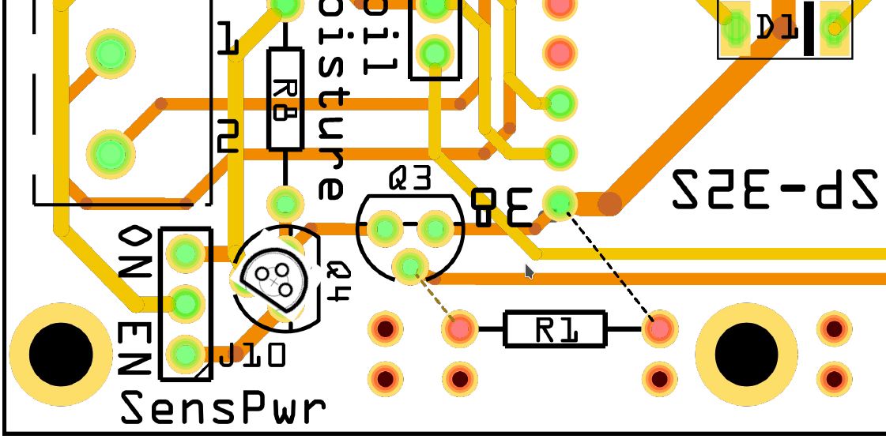

# flora2 - Hardware

## Files
<table>
<thead>
  <tr>
    <th>File</th>
    <th>Description</th>
  </tr>
</thead>
<tbody>
  <tr>
    <td><a href="https://github.com/matthias-bs/Flora2/blob/main/08_hardware/flora2.fzz" target="_blank" rel="noopener noreferrer">flora2.fzz</a></td>
    <td>Fritzing Schematic and PCB</td>
  </tr>
  <tr>
    <td><a href="https://github.com/matthias-bs/Flora2/blob/main/08_hardware/flora2_pcb.pdf" target="_blank" rel="noopener noreferrer">flora2_pcb.pdf</a></td>
    <td>Printed Circuit Board </td>
  </tr>
  <tr>
    <td><a href="https://github.com/matthias-bs/Flora2/blob/main/08_hardware/flora2_sch.pdf" target="_blank" rel="noopener noreferrer">flora2_sch.pdf</a></td>
    <td>Schematic</td>
  </tr>
  <tr>
    <td><a href="https://github.com/matthias-bs/Flora2/blob/main/08_hardware/flora2_pcb_v1.0p1_patch_q4.pdf" target="_blank" rel="noopener noreferrer">flora2_pcb_v1.0p1_patch_q4.pdf</a></td>
    <td>Description of Patch p1 (Q4 Pin Mismatch)</td>
  </tr>
  <tr>
    <td><a href="https://github.com/matthias-bs/Flora2/blob/main/08_hardware/flora2_pcb_v1.0p1_patch_q4.png" target="_blank" rel="noopener noreferrer">flora2_pcb_v1.0p1_patch_q4.png</a></td>
    <td>Description of Patch p1 (Q4 Pin Mismatch)</td>
  </tr>
</tbody>
</table>

## Bugs

- Distance between D1-4 and nearby resistors too small
- U1 (voltage regulator) blocks access to Micro-USB connector
- PCB for case "BOPLA EM 220 F" too wide
  
  B_actual:  75,5
  
  B_target: 73,0
  
  -> using "BOPLA EM 217 F" instead
  
- No mounting holes for case "BOPLA EM 220 F"

  -> using "BOPLA EM 217 F" with base plate ([dxf](../12_mounting/flora2_base_plate.dxf) | [pdf](../12_mounting/flora2_base_plate.pdf))

- Wrong footprint for U1 ESP32 DevKit
  
  B_actual:  22,86mm (fits [HiLetgo ESP-32S](http://www.hiletgo.com/ProductDetail/1906566.html)!)
  
  B_target: 25,25mm (fits AZ-Delivery ESP32-DevKitC V4/JoyIt NodeMCU ESP32)
  
- Wrong footprint for Q4 ZVP2106A (**see patch p1**)
- Add pull-down resistor 10 kOhm at gate of Q3, otherwise Sensor_PWR_int wpuld be active in Deep-Sleep-Mode (**see patch p1**)

**Patch p1**

## Open Issues
- add capacitors 100nF parallel to ADC inputs
- add voltage divider for Ubatt measurement as assembly option: R10=200k, R11=100k (opt.) 
- add DS18B20 + pull-up resistor 4k7 (opt.)
- add pull-down resistors for pump drivers (opt.)
- reduce Standby-Power in Deep-Sleep-Mode (opt.)
    - remove R10 or LED2 (red) from ESP-32S module

## Copyright Notice
Image: https://de.123rf.com/lizenzfreie-bilder/90587529.html

Name:

(de) Gießkanne und Blumen in Töpfen. Bewässerungssymbol lokalisiert auf weißem Hintergrund

(en) Watering can and flowers in pots. Irrigation symbol isolated on white background

File No.: 90587529

Copyright: [nikolae](https://www.123rf.com/profile_nikolae/)

Please check license on 123RF when using the image. Using the image as silkscreen print on PCB for non-commercial purposes was agreed upon by 123RF.
