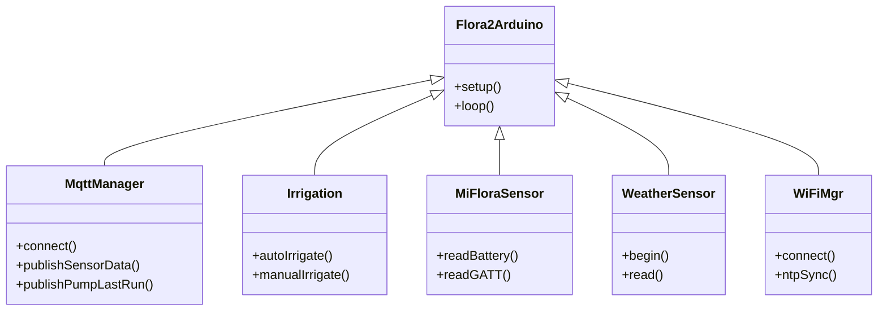
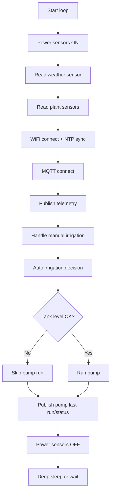

# Flora2 Arduino Sketch — Documentation

## 1. Introduction

Flora2 Arduino is a C++ / Arduino port of the Flora2 plant irrigation controller, originally written in MicroPython. It targets ESP32 DevKit-style boards and provides:

- Automated irrigation driven by capacitive moisture sensors.
- Manual irrigation via MQTT commands.
- MiFlora BLE plant sensor reads via direct GATT (temperature, moisture, light, conductivity, battery, RSSI).
- I²C weather sensor support — M5Stack ENV III (SHT3x + QMP6988) or BME280.
- MQTT telemetry and control with optional Home Assistant discovery.
- Deep sleep cycles with state persistence across resets (`RTC_DATA_ATTR`).

---

## 2. Set-up and Installation

### Prerequisites

- Arduino CLI or Arduino IDE with ESP32 board support (Arduino core 3.3.8 recommended).
- Required libraries — see [Acknowledgements](#5-acknowledgements).
- `data/config.json` uploaded to the board's LittleFS partition and a `secrets.h` file with WiFi and MQTT credentials.

### Building and uploading

1. Open the `14_arduino/Flora2Arduino` sketch in Arduino IDE or `arduino-cli`.
2. Install the required libraries (see [Acknowledgements](#5-acknowledgements)).
3. Copy `secrets.h.example` to `secrets.h` and fill in your WiFi networks and MQTT broker credentials.
4. **Compile and upload** — preferred via Arduino IDE: *Sketch → Upload*. Alternatively, use the included VS Code tasks or the build script:

```bash
# Compile
bash .vscode/arduino-compile-runner.sh compile
# Upload — replace /dev/ttyUSB0 with your serial port
bash .vscode/arduino-compile-runner.sh upload --port /dev/ttyUSB0
```

### Uploading the LittleFS filesystem

Place your `config.json` at `data/config.json` inside the sketch folder, then use the Arduino LittleFS Upload plugin or `arduino-cli` to flash the filesystem image.

### Configuration

- **Runtime** — `data/config.json` defines plant identities, sensor interface mode (BLE / LOCAL / MQTT), moisture thresholds, and irrigation durations. See `ConfigLoader` for the full schema.
- **Compile-time** — `Flora2Cfg.h` contains hardware pin assignments and feature flags such as `WEATHER_SENSOR_ENV3` and `TEMPERATURE_SENSOR_EN`.
- **Default PCB wiring note** — moisture sensor 2 input and battery voltage ADC are both routed to GPIO 35 on the default Flora2 hardware. Changing either signal to a different GPIO requires a PCB hardware patch.
- **Timezone / DST** — `TIMEZONE_STR` in `Flora2Cfg.h` sets the POSIX timezone string (e.g. `"CET-1CEST,M3.5.0,M10.5.0/3"`). Edit it to match your location before compiling.

---

## 3. Usage

### Serial output

Diagnostics are written to the serial console at 115200 baud. Useful output includes I²C bus scans, BLE GATT reads, MQTT publish results, and per-plant irrigation decisions.

> [!NOTE]
> To enable detailed log output (`log_d`, `log_i`, `log_w`, `log_e`), open **Tools → Core Debug Level** and select a level above **None** (for example **Info** or **Debug**), then recompile and upload.

### MQTT topics

The base topic defaults to `flora2` and can be overridden in `config.json` or `Flora2Cfg.h`.

| Topic | Description |
|---|---|
| `flora2/status` | Device status — see note below |
| `flora2/ubatt` | Battery voltage in mV |
| `flora2/weather` | JSON: `{"temperature":…,"humidity":…,"pressure":…}` |
| `flora2/sensor/{plant_id}` | Per-plant JSON: `{"temperature":…,"moisture":…,"light":…,"conductivity":…,"battery":…,"rssi":…}` |
| `flora2/pump{N}/last_run` | Retained JSON: `{"epoch":…,"iso":"YYYY-MM-DDTHH:MM:SS+hhmm","trigger":"auto|manual|unknown"}`; refreshed every cycle |
| `flora2/pump{N}/status` | Retained `"on"` / `"off"`; refreshed every cycle |
| `flora2/sleep_dis_status` | Retained `"1"` / `"0"`; deep-sleep disabled/enabled |
| `flora2/man_irr_duration_status` | Manual irrigation duration in seconds; refreshed every cycle, not retained |
| `flora2/auto_irr_duration1_status` | Auto irrigation duration for pump 1 in seconds; refreshed every cycle, not retained |
| `flora2/auto_irr_duration2_status` | Auto irrigation duration for pump 2 in seconds; refreshed every cycle, not retained |

**Status topic:** the device publishes `"online"` on connect and `"sleeping"` before a graceful disconnect. The MQTT Last Will and Testament (LWT) is configured to publish `"dead"` (retained, QoS 1) — but only if the client drops without a clean disconnect. After a normal cycle `"sleeping"` is always the last value written by the device itself.

### Manual irrigation commands

| Topic | Payload | Effect |
|---|---|---|
| `flora2/man_irr_cmd` | pump number (e.g. `2`) | Trigger a manual run on that pump |
| `flora2/man_irr_duration_ctrl` | duration in seconds | Override the manual irrigation duration (all pumps) |
| `flora2/auto_irr_duration1_ctrl` | duration in seconds | Override the auto irrigation duration for pump 1 |
| `flora2/auto_irr_duration2_ctrl` | duration in seconds | Override the auto irrigation duration for pump 2 |
| `flora2/auto_irr_ctrl` | `1` / `0` | Enable / disable automatic irrigation |

The device publishes the corresponding status topics `man_irr_duration_status`, `auto_irr_duration1_status`, and `auto_irr_duration2_status` on every MQTT cycle without the retain flag. The other device status topics remain retained.

### Receiving commands across deep sleep

On every wakeup the device reconnects to the broker and re-subscribes to all control topics at QoS 1. If a message was published with the **retain flag**, the broker re-delivers it immediately on subscribe — so the device always receives the current setting value, regardless of how long it was sleeping.

The received values are written to `RTC_DATA_ATTR` variables (`rtc_auto_irr_enabled`, `rtc_man_irr_duration`, `rtc_auto_irr_duration[2]`, `rtc_sleep_disabled`) which survive deep-sleep resets for the rest of the power-on session.

> [!NOTE]
> The examples below use `mosquitto_pub` because it makes the required topic, payload, retain, and QoS settings explicit. You can use any MQTT client that supports the same options, including GUI tools such as MQTT Explorer.

**Persistent settings** — publish with `-r` (retain) and `-q 1` (QoS 1). The retain flag ensures the broker re-delivers the value on every reconnect. QoS 1 guarantees the broker acknowledges receipt and, on Mosquitto, persists the retained message to disk so it survives a broker restart:

```bash
# Disable automatic irrigation (persists across sleep)
mosquitto_pub -h <broker> -q 1 -r -t "flora2/auto_irr_ctrl" -m "0"

# Re-enable automatic irrigation
mosquitto_pub -h <broker> -q 1 -r -t "flora2/auto_irr_ctrl" -m "1"

# Set manual irrigation duration to 30 s (persists across sleep)
mosquitto_pub -h <broker> -q 1 -r -t "flora2/man_irr_duration_ctrl" -m "30"

# Set auto irrigation duration for pump 1 to 45 s (persists across sleep)
mosquitto_pub -h <broker> -q 1 -r -t "flora2/auto_irr_duration1_ctrl" -m "45"

# Set auto irrigation duration for pump 2 to 120 s (persists across sleep)
mosquitto_pub -h <broker> -q 1 -r -t "flora2/auto_irr_duration2_ctrl" -m "120"

# Disable deep sleep (persists across sleep)
mosquitto_pub -h <broker> -q 1 -r -t "flora2/sleep_dis_ctrl" -m "1"
```

**One-shot commands** — `man_irr_cmd` is published **with** the retain flag (`-r`) and QoS 1. The device executes it once, then publishes a retained `"0"` back to the broker to clear the stored value. On subsequent wakeups the broker re-delivers `"0"`, which the device ignores. A power-cycle (cold boot) also sees `"0"` and does not re-fire.

```bash
# Trigger pump 1 — can be sent at any time, including while the device is sleeping
mosquitto_pub -h <broker> -q 1 -r -t "flora2/man_irr_cmd" -m "1"
```

> [!NOTE]
> The device guards against duplicate delivery by comparing the received pump number against `rtc_last_man_irr_cmd` (stored in `RTC_DATA_ATTR`). If the broker reset publish fails and the same value is re-delivered on the next wakeup, the command is silently ignored rather than re-fired.

### Automatic irrigation

Auto irrigation runs during each main cycle, after sensor reads and MQTT connect. For every plant configured in automatic mode in `config.json`, the `Irrigation` engine decides whether to activate its pump.

**Trigger condition** — a pump run is initiated when all of the following hold:

- Measured moisture is below the plant's `moist_min` threshold.
- The rest cooldown (`irr_rest`) has elapsed since the last run.
- The current time is outside the configured night window.
- The tank level sensor reports sufficient water.

**Safety interlocks** — any one of the following blocks a pump run:

| Interlock | Detail |
|---|---|
| **Tank empty** | `TANK_EMPTY` float switch (GPIO 21) is checked before and during every run; the pump stops immediately if the tank empties to prevent dry running. |
| **Tank low** | `TANK_LOW` float switch (GPIO 23) is polled during a run; the run completes but the result is flagged `TANK_LOW` and logged. |
| **Night window** | Irrigation is suppressed between `night_begin` and `night_end` (set in `config.json`; noise prevention). |
| **Rest period** | The `irr_rest` cooldown must have elapsed since `last_run` before the pump can fire again. (allow for seepage) |
| **High light intensity** | Per-plant `light_irr` threshold: irrigation is suppressed when ambient lux exceeds this value to reduce the risk of leaf burn. |
| **Battery critically low** | If battery voltage is below `battery_low` (mV), the device skips the main cycle entirely and enters a 1-hour deep sleep. |

Manual irrigation commands bypass the auto-decision logic for the current cycle but still respect the tank-empty interlock.

**Published every cycle:**

- Retained `pump{N}/status` and `pump{N}/last_run` are refreshed for every pump on each MQTT cycle.
- `man_irr_duration_status`, `auto_irr_duration1_status`, and `auto_irr_duration2_status` are also published every cycle, but without the retain flag.
- `last_run` includes `trigger` to indicate whether the stored run was caused by `manual` or `auto` irrigation (`unknown` before the first successful run).
- If a pump ran, `last_run` contains the updated timestamp; otherwise the previous stored timestamp is published again unchanged.
- If the clock is not yet synced, the stored timestamp is left unchanged and a warning is logged when a run occurs before time is valid.

---

## 4. Implementation details

### Architecture

| Component | Role |
|---|---|
| `Flora2Arduino.ino` | `setup()` and `loop()`: hardware init, sensor reads, WiFi/NTP, MQTT, irrigation, deep sleep |
| `ConfigLoader` | Loads `AppConfig` from LittleFS `config.json` |
| `WeatherSensor` | Driver for ENV III (SHT3x + QMP6988) or BME280 |
| `MiFloraSensor` | Direct BLE GATT reads; battery cached in NVS |
| `Irrigation` | Decision engine: night window, moisture thresholds, rest times, tank checks |
| `MqttManager` | Publish / subscribe helpers, LWT, HA discovery |
| `WiFiMgr` | WiFi connection and NTP sync |

### Class diagram



### Main loop



### Key implementation notes

- **Timezone / DST** — `setenv("TZ", TIMEZONE_STR, 1); tzset();` is called on every boot so that `localtime()` returns correct local time after deep-sleep resets (the TZ environment variable is not retained across sleep).
- **Pump last-run metadata** — timestamps are updated only when `time(nullptr)` returns a plausible value (post-2021), confirming a valid NTP sync. The trigger source (`auto` / `manual`) is persisted per pump in `RTC_DATA_ATTR` and included in the published `pump{N}/last_run` JSON.
- **BLE** — passive advertisement scanning has been removed; direct GATT reads provide reliable sensor values. Battery readings are cached in NVS to survive cycles where the GATT connection fails.
- **Weather sensor detection** — the driver performs an I²C bus scan on init failure and logs all found addresses, making hardware wiring problems straightforward to diagnose from serial output.
- **ENV III driver vendored** — the SHT3X, QMP6988, and I2C_Class sources from M5Unit-ENV are vendored into `src/env3/` instead of declaring the library as a dependency. The published M5Unit-ENV library pulls in the entire M5UnitUnified framework and its cascading transitive dependencies, which is impractical for a standalone sketch. The three driver files are self-contained, MIT-licensed, and only `WeatherSensor.cpp` includes them.

---

## 5. Acknowledgements

| Library | Author | Purpose |
|---|---|---|
| [NimBLE-Arduino](https://github.com/h2zero/NimBLE-Arduino) | h2zero | BLE central / GATT client |
| [ArduinoJson](https://github.com/bblanchon/ArduinoJson) | bblanchon | JSON parsing and config |
| [arduino-mqtt](https://github.com/256dpi/arduino-mqtt) | 256dpi | MQTT client |
| [OneWireNg](https://github.com/pstolarz/OneWireNg) | pstolarz | DS18x OneWire driver (optional) |
| [M5Unit-ENV](https://github.com/m5stack/M5Unit-ENV) | m5stack | SHT3x + QMP6988 driver for ENV III (optional) |
| [pocketBME280](https://github.com/angrest/pocketBME280) | angrest | BME280 driver (optional) |
